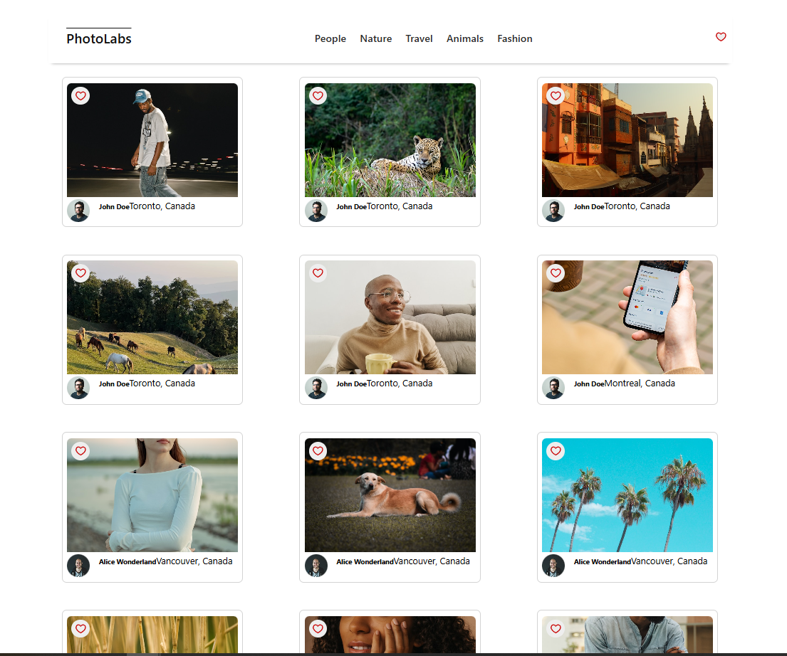
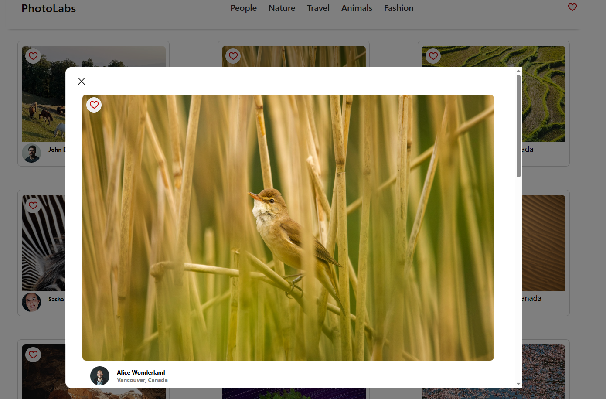
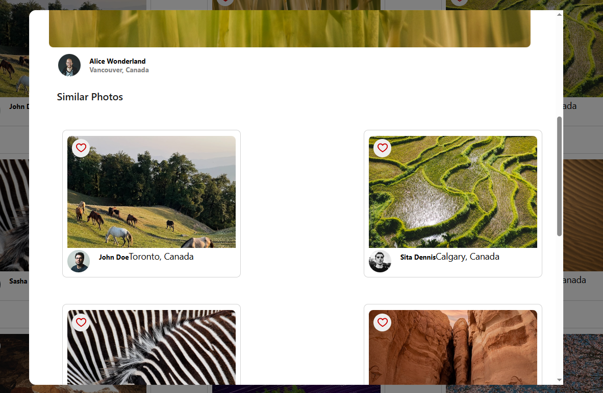

# 📷 PhotoLabs React App 📷

### **Your Gateway to Stunning Photos!**

Hey there! 👋 Welcome to PhotoLabs, a React-based application designed to showcase beautiful photos and let you interact with them in a fun and intuitive way.

## **🖼️ Final Product**

👀 Here is a sneak peak on what the website look like 👀

### Home Page


This is the **Home Page** of PhotoLabs, where users can see all uploaded pictures, poster's details, short by catagory, and favorite **your favorite** photos!

### The Modal


This is the **Modal** of PhotoLabs. To access this simply click on a picture on the home page to display a enlarged image of the selected photo.


The **Modal** will also display all photos that share the same **topic** as the selected photo. Liking photos in the **Modal** will also reflect on the **Home Page**.

## ⌨ Setup

Install dependencies with `npm install`.

Note: This project requires at least Node v16

## 🏃‍♀️ Run The Development Server

Start the server with

```sh
npm run dev
```

You can visit the running application at [http://localhost:3000](http://localhost:3000)

## 🏃‍♂️🏃‍♀️ Run The Linter

You can run eslint with the following command:

```sh
npm run lint
```

## 🏃‍♂️🏃‍♀️🏃‍♂️ Run The Jest Tests

The tests can be run with:

```sh
npm run test
# or
npm test
```